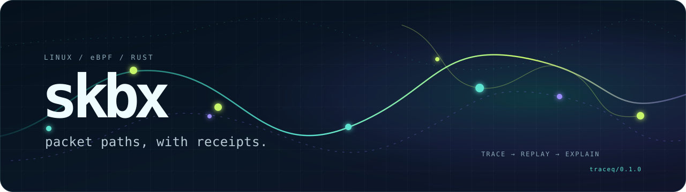

<p align="center">
  
</p>

<p align="center">
  <a href="https://github.com/copyleftdev/skbx/actions/workflows/ci.yml"></a>
  <a href="LICENSE"></a>
  
  
</p>

# skbx

`skbx` shows where a packet went inside Linux—and keeps the receipts.

It observes kernel networking functions, TC/XDP programs, packet
transformations, tunnels, drops, and selected BPF helper activity with
Rust and CO-RE eBPF. Every observation lands in a bounded, replayable evidence
stream with stable handles and explicit loss telemetry.

Use it when “the packet disappeared” is not a sufficient incident report.

```text
capture → event:8c6f… → replay → route:21b4… → explain
            evidence          pattern          context
```

> Inspired by [pwru](https://github.com/cilium/pwru), rebuilt around an
> agent-first contract: deterministic observations, machine-readable
> capabilities, bounded state, and no invented evidence.

## The short version

| You need to… | skbx gives you… |
|---|---|
| See the kernel path of an SKB | BTF-discovered kprobes with exact function evidence |
| Follow clones, copies, COW, and XDP-to-SKB transitions | Capture-local lineage IDs and explicit match origin |
| Inspect TC or XDP behavior | Exact program identity, entry/exit pairing, and decoded XDP actions |
| Filter without guessing field layouts | Target-BTF-checked packet and metadata expressions |
| Hand evidence to a human or agent | Versioned JSONL, stable handles, deterministic replay, and `explain` |
| Know whether the trace is trustworthy | Reserve, recursion, read, decode, enrichment, and output telemetry |

## First packet

Build prerequisites are listed below. Once `skbx` is installed:

```console
# 1. Check the host.
skbx doctor --json

# 2. See exactly what would attach—without attaching it.
skbx plan --filter-func 'ip.*' --json

# 3. Capture ten bounded seconds of ICMP evidence.
sudo skbx capture --probe ip_rcv \
  --duration 10 \
  --output trace.jsonl \
  icmp

# 4. Rebuild packet routes without root.
skbx replay trace.jsonl --format json

# 5. Follow any event handle back to its surrounding evidence.
skbx explain trace.jsonl event:<handle>
```

Want a fast human view instead?

```console
sudo skbx capture --probe tcp_v4_do_rcv \
  --format text \
  --timestamp relative \
  --output-caller \
  --output-tcp-flags \
  --output -
```

## Built for operators *and* agents

The CLI explains itself before an agent touches the host:

```console
skbx describe --format json  # commands, capabilities, limits, invariants
skbx schema                  # the versioned traceq JSON Schema
skbx doctor --json           # host prerequisites with actionable evidence
skbx plan --json             # deterministic attachment plan
```

The native engine remains the source of truth. An AI system may explain a
captured event, but it cannot manufacture one. Machine output stays on stdout;
diagnostics stay on stderr; missing footers and observation loss are explicit.

## What it can observe

- BTF-discovered `struct sk_buff *` arguments in positions 1–5;
- individual kprobes and signature-grouped kprobe-multi attachment;
- base and split BTF from named or all loaded kernel modules;
- IPv4/IPv6, bounded extension chains, TCP/UDP/ICMP, fragments, and TCP flags;
- mark, interface, namespace, MTU, socket fallback, and caller evidence;
- independent outer and inner-L2/inner-L3 libpcap predicates;
- SKB clone/copy/COW lineage and XDP frame-to-SKB correlation;
- stack-associated non-SKB teardown paths through logical free;
- JIT-discovered BPF helper calls and bounded map key/value evidence;
- TC entry observations and paired XDP entry/exit actions;
- BTF-checked SKB/XDP metadata, bitfields, byte-order-aware filters, and
  bounded boolean expressions;
- atomic `sk_buff` and `skb_shared_info` BTF renderings;
- named SKB drop reasons, kernel stacks, and the SKB control buffer;
- exact capture limits, rotation boundaries, and reliability footers.

The full, evidence-backed comparison with pwru lives in
[the parity matrix](docs/pwru-parity.md). Design invariants and the hot-path
model live in [the architecture guide](docs/architecture.md).

## Useful captures

### Follow a marked packet through transformations

```console
sudo skbx capture \
  --filter-mark 0x2a \
  --filter-track-skb \
  --output trace.jsonl
```

### Filter on target-kernel fields

```console
sudo skbx capture --probe ip_rcv \
  --filter-skb-expr \
    'skb->mark = 0b101010 && skb->protocol = 0x0800' \
  --output-skb-metadata 'skb->dev->ifindex' \
  --output trace.jsonl
```

### Observe loaded XDP programs

```console
sudo skbx capture \
  --filter-trace-xdp \
  --filter-xdp-expr \
    '(xdp->frame_sz = 0 || xdp->frame_sz >= 0o1)' \
  --output-xdp-metadata 'xdp->rxq->dev->ifindex' \
  --output trace.jsonl \
  icmp
```

### Inspect a tunnel

```console
sudo skbx capture --probe ip_local_out \
  --output-tunnel \
  --filter-tunnel-pcap-l2 'ether proto 0x0800' \
  --filter-tunnel-pcap-l3 'icmp' \
  --output trace.jsonl \
  udp port 4789
```

Run `skbx capture --help` for the complete surface.

## Evidence model

The native stream is `traceq/0.1.0`: append-only JSONL bounded by a mandatory
header and footer.

```text
capture_start
event
event
…
capture_end
```

Each event carries a stable `event:` handle. Replay groups ordered events into
bounded packet routes, reports consensus and outliers, and emits `route:`
handles. `explain` retrieves the target event plus nearby evidence sharing the
same packet identity.

If the footer is absent—or reports reserve failures, tracer recursion misses,
decode failures, enrichment failures, or output failures—the capture is not
silently presented as complete.

## Install from source

### Requirements

- Linux on x86_64 or arm64;
- Rust 1.85 or newer;
- Clang/LLVM with the BPF backend;
- `bpftool`;
- libelf and libpcap development packages;
- a kernel exposing `/sys/kernel/btf/vmlinux`;
- root or appropriate BPF/perf capabilities for live capture.

On Ubuntu:

```console
sudo apt-get install "linux-tools-$(uname -r)" clang llvm libelf-dev libpcap-dev pkg-config
```

On Debian:

```console
sudo apt-get install bpftool clang llvm libelf-dev libpcap-dev pkg-config
```

If a vendor-specific Ubuntu kernel-tools package omits `bpftool`, install
`linux-tools-generic` and put the directory containing its `bpftool` binary
first on `PATH`.

Then build:

```console
git clone https://github.com/copyleftdev/skbx.git
cd skbx
cargo build --release --locked
sudo install -m 0755 target/release/skbx /usr/local/bin/skbx
skbx doctor
```

Replay, schema inspection, and evidence lookup do not require root.

## Development

```console
make check      # fmt + tests + clippy -D warnings
make build      # optimized release build
make benchmark  # deterministic 100k-event replay benchmark
```

The build generates `vmlinux.h` in Cargo’s output directory and embeds the
compiled CO-RE object. Generated kernel headers never dirty the source tree.

Root-required integration gates use disposable network namespaces and clean up
after themselves. See [the validation guide](docs/validation.md) before
running them.

## Community

Network debugging gets better when evidence is easy to share.

- Found a bug? Use the structured
  [bug report](https://github.com/copyleftdev/skbx/issues/new?template=bug.yml).
- Have a packet path skbx cannot explain yet? Open an
  [observation request](https://github.com/copyleftdev/skbx/issues/new?template=observation.yml).
- Want to contribute? Start with [CONTRIBUTING.md](CONTRIBUTING.md).
- Found a security issue? Please follow [SECURITY.md](SECURITY.md), not a
  public issue.

Bring a kernel version, the exact command, `doctor --json`, and the reliability
footer. Packet folklore is welcome; packet evidence is better.

## License

Userspace is licensed under
[AGPL-3.0-or-later](LICENSE). The eBPF program under `bpf/` is
GPL-2.0-only.
